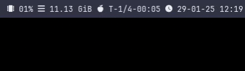

# pomodozig

[![CI][status-png]][status]

`pomodozig` is a simple terminal based pomodoro timer written in `Zig`. It can 
be used in the terminal or embedded in a status bar such as `polybar` as shown 
below.

<div align="center">
    
</div>

## Installation

A static binary is available in the [releases][releases] page. It should work 
on any linux distribution. For nix users, an overlay is available in [the flake 
file](./flake.nix).

## Usage

```
$ pomodozig -h
Usage: pomodozig
[-t <task_length>]    Task length in minutes (default: 25 mins)
[-sb <short_break>]   Short break length in minutes (default: 5 mins)
[-n <num_pomodoros>]  Number of pomodoros before long break (default: 4)
[-lb <long_break>]    Long break length in minutes (default: 15 mins)
[-s]                  Disable notifications
[-h]                  Show this help message
```

## Use in Polybar

Here is an example of how to embed `pomodozig` in `polybar`:

```ini
[module/pomodozig]
type = custom/script
label = 🍅 %output%
interval = 1
exec = pomodozig
tail = true
; pause/resume
click-left = kill -USR1 %pid%
; reset
click-right = kill -USR2 %pid%
```

## Controls

`pomodozig` can be controlled with the following keys:

- `q` Quit
- `p` Pause/Resume
- `r` Reset the current task/break. Hit twice to reset the whole session.

or with signals:

- `SIGUSR1` Pause/Resume
- `SIGUSR2` Reset the current task/break. Send twice to reset the whole 
  session.

## Notifications

`pomodozig` notifies you when a task or break is over, using `notify-send` the 
program shipped with `libnotify`. It can be disabled with the `-s` flag.

[nix]: https://nixos.org/
[releases]: https://github.com/jecaro/pomodozig/releases
[status-png]: https://github.com/jecaro/pomodozig/workflows/CI/badge.svg
[status]: https://github.com/jecaro/pomodozig/actions

